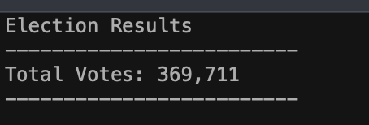
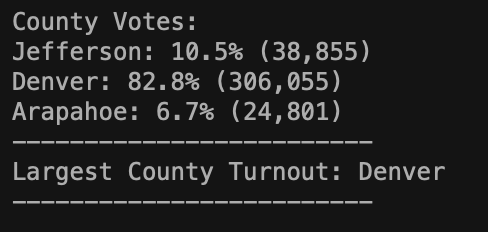
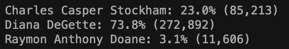
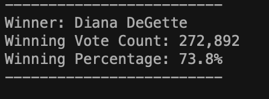

# Election_Analysis
## Project Overview
A Colorado Board of Elections employee has given me the following tasks to complete the
election audit of a recent local congressional election. The audit will show:

1. Calculate the number of votes cast.
2. Get a complete list of candidates who received votes.
3. Calculate the total number of votes each candidate received.
4. Calculate the percentage of votes each candidate won.
5. Determine the winner of the election based on popular vote.
6. Calculate the number of votes per County
7. Calculate the percentage of votes per County
8. Display which county had the largest turnout of votes

## Resources
- Data Source: election_results.csv
- Software: Python 3.8.9, Visual Studio Code, 1.66.2

## Election-Audit Results
The analysis of the election show that:

- There were *369,711* votes cast in the election.

- The breakdown of County votes and the respective percentages were:
  - Jefferson County with 38,855 votes. 10.5% of the votes.
  - Denver County with 306,055 votes. 82.8% of the votes.
  - Arapahoe County with 24,801 votes 6.7% of the votes.
  - With Denver County having the largest County turnoutof votes.

- The breakdown of candidates were:
  - Charles Casper Stockham
  - Diana DeGette
  - Raymon Anthony Doane

- With the candidate's results being:
  - Charles Casper Stockham received *23.0%* of the vote and *85,213* number of votes
  - Diana DeGette received *73.8%* of the vote and *272,892* number of votes
  - Raymon Anthony Doane received *3.1%* of the vote and *11,606* number of votes

- The winner of the election was:
  - Diana DeGette who received *73.8%* of the vote and *272,892* number of votes.

## Summary
In Summary, with a given data set and a few modifications, we are able to tailor this script to analyze not just local elections, but elections in the state and congressional levels.